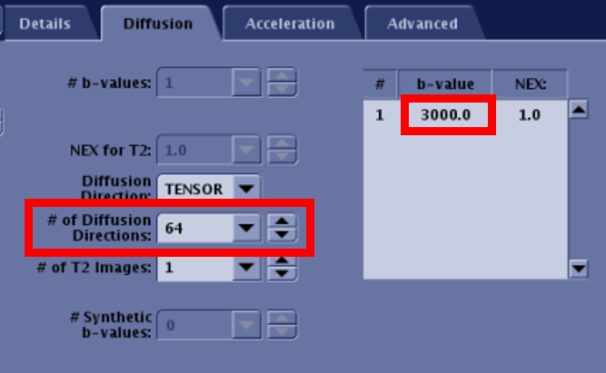
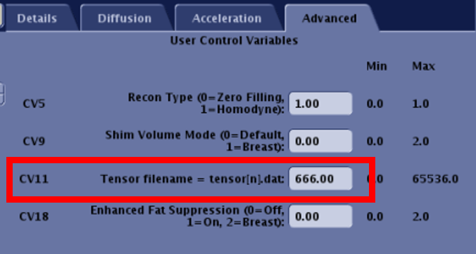

# Q-Space-Sampling to GE

This script allows you to convert a `samples.txt` file generated
from the [Emmanuel Caruyer's web application](http://www.emmanuelcaruyer.com/q-space-sampling.php)
to a tensorXXX.dat file you can use for DTI sequences on a GE MRI System.

## Disclaimer

As usual it's "AS IS" and for research only !

Please read the Tests part of this README carefully.

## Cite

Please kindly cite the following relevant article when you use
the sampling scheme :

> Emmanuel Caruyer, Christophe Lenglet, Guillermo Sapiro, Rachid Deriche. Design of multishell sampling schemes with uniform coverage in diffusion MRI. Magnetic Resonance in Medicine, Wiley, 2013, 69 (6), pp. 1534-1540. http://dx.doi.org/10.1002/mrm.24736

## Usage

This installation was tested on a SIGNA Premier system (RX29.1).

Download your sample scheme from the [Emmanuel Caruyer's web application](http://www.emmanuelcaruyer.com/q-space-sampling.php)
Get the script and the file `samples.txt` to your home directory and open a terminal.

Generate the `tensorXXX.dat` from the `samples.txt` file (here with an example of [64 directions and 3 shells](http://www.emmanuelcaruyer.com/WebApp/q-space-sampling.php?nbPoints=64&nbShells=3&alpha=2)) :

```bash
python qspacesampling2ge.py samples.txt tensorXXX.dat 3000 2000 1000
```

Copy and rename the `tensorXXX.dat` to `/usr/g/bin/` (be careful to not erase previously existing tensor files) :

```bash
ls -l /usr/g/bin/tensor*
cp tensorXXX.dat /usr/g/bin/tensor666.dat
```

In a DTI sequence :
- Set the number of direction to the number you setup in the Q-space-sampling scheme
- Set the b-value to the maximum b-value of your shell

- use the advanced panel to setup the tensor file number.



## Tests

This script was tested on a 3T MRI SIGNA PREMIER system (MR29.1).

Using the same sampling described in the Usage section, here is the results of
the comparison of the bvec/bval files obtained after converting the DICOM using 
[dcm2niix](https://github.com/rordenlab/dcm2niix) and the original samples.txt file.

The results are given by the `tests/test.py` script (run it in the tests directory)

### X coordinate sign

The `u_x` given by the sampling scheme and the x coordinate obtained in the bvec file are reversed in sign.
I choose to flip the sign of the x coordinate in the script to correct this.

### Rounding problems

```
DIR12 Found bvalues mismatch : expected 2000 / got 2005.0
DIR12 Found direction mismatch in X : expected 0.74 / got 0.739077
DIR12 Found direction mismatch in Y : expected 0.597 / got 0.596255
DIR12 Found direction mismatch in Z : expected 0.312 / got 0.311611
DIR63 Found bvalues mismatch : expected 3000 / got 3005.0
DIR63 Found direction mismatch in X : expected -0.522 / got -0.521566
DIR63 Found direction mismatch in Y : expected 0.61 / got 0.609492
DIR63 Found direction mismatch in Z : expected 0.597 / got 0.596503
```

As you can see there are some case where there is probably some rounding errors of the b-values.
I still need to investigate on how to mitigate this.

